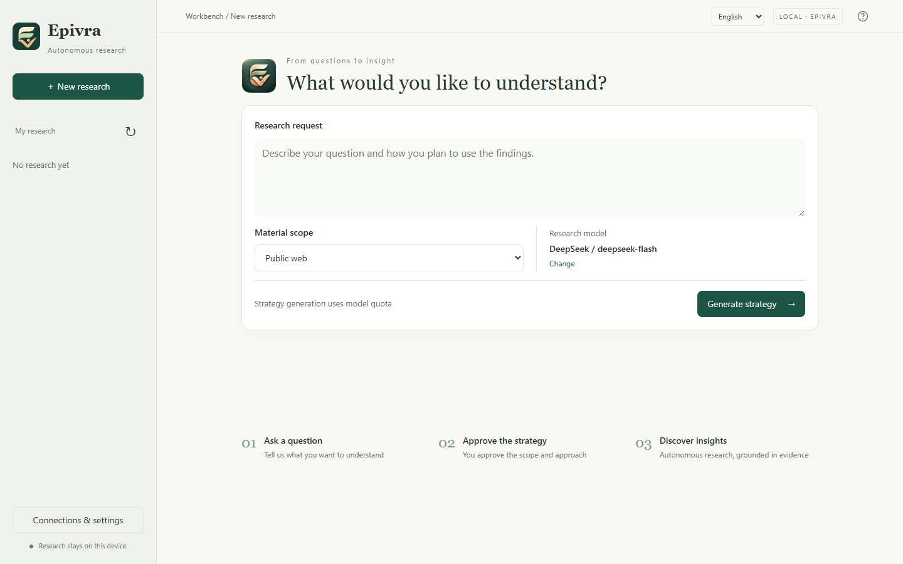

<p align="center"></p>
<h1 align="center">Epivra</h1>
<p align="center">Autonomous research on your desktop</p>
<p align="center"><strong>English</strong> · <a href="README.zh-CN.md">简体中文</a></p>



Epivra is a local research workbench that turns a question and authorized materials into a source-linked report. It combines public web research, local documents, optional data analysis, and external MCP tools. Web, terminal, and MCP interfaces share the same local research workspace.

## Research workflow

Describe the question, intended use, and material scope, then review and approve the initial research route. A research owner investigates the question, maintains findings and unresolved conflicts, prepares the writing basis, and revises a shared manuscript. It can investigate and write directly or delegate focused tasks to assistants when useful.

Approval is required once. Research continues within that authorization without further approval requests; you can pause, cancel, add materials, or adjust direction through the workbench. A saved draft is not a published result. An independent reviewer must accept the current manuscript before publication, and changes to the manuscript require another review. Reports have no default word limit.

Sources, excerpts, findings, reports, and recorded usage remain in the local workspace. Citation checks and independent review support inspection; they do not guarantee that conclusions are correct.

## Quick start

Requires **Python 3.11 or later** and access to a supported model provider. Clone the repository and run these commands in Windows PowerShell:

```powershell
git clone https://github.com/studyzhige-ui/Epivra.git
cd Epivra
python -m venv .venv
.venv/Scripts/python.exe -m pip install .
.venv/Scripts/epivra.exe --lang en web --port 0
```

Open **Connections & settings**, choose a provider, enter its API key, and select a model. Create a research question, select its materials, generate the route, and approve it. The browser opens automatically; port `0` selects an available port. Keep the host running while research proceeds.

No Node.js, frontend build, or database server is needed to run the workbench. On macOS/Linux, virtual-environment executables are under `.venv/bin/`. Windows is the verified local environment; cross-platform acceptance is not claimed.

## Interfaces and capabilities

| Entry | Purpose |
|---|---|
| `epivra --lang en web` | Browser workbench: configure connections, manage research, inspect sources, and export reports |
| `epivra --lang en` | Interactive terminal workbench |
| `epivra --help` | JSON commands for local automation |
| `epivra-mcp --root <absolute-workspace-path>` | MCP access for another client; requires the MCP extra and a running host |

The Web interface switches between English and Simplified Chinese. Set the desired report language in the research request. Reports can be exported as Markdown, Word, or standalone HTML; PDF export uses the browser's print dialog.

- **Model connections:** OpenAI, Claude, Gemini, Grok, DeepSeek, Qwen, Kimi, GLM, Doubao, MiniMax, Hunyuan, and ERNIE through official provider adapters. The default selection is DeepSeek / `deepseek-flash`; account availability varies.
- **Search and reading:** Tavily, Exa, Brave, Perplexity, Bocha, a key-free DuckDuckGo fallback, and Jina reading. Network-enabled research can also use Crossref, PubMed, Europe PMC, and World Bank public data.
- **Materials:** text, CSV/TSV, text PDFs, and spreadsheets; the optional documents extra adds Docling parsing and OCR. Sources are accessed within the selected permissions.
- **Analysis:** optional Python calculations and charts in Docker Linux containers with no network access.
- **External MCP:** explicitly permitted tools and resources can be used by research assistants. Local-material mode disables built-in web research but may still use selected external MCP services.

Provider calls may incur charges. Epivra does not impose a total research time, token, or cost budget. Recorded usage is not a billing statement.

## Optional components

Use the virtual environment's Python for installation:

```powershell
.venv/Scripts/python.exe -m pip install ".[documents]"  # Document parsing and OCR
.venv/Scripts/python.exe -m pip install ".[mcp]"        # MCP integration
```

Download parsing models using the [local model guide](models/README.en.md). For data analysis, install Docker with Linux containers and build `docker build -t epivra-analysis:1 sandbox`, then enable analysis in settings. These components are optional.

## Workspace and repository

| Path | Contents |
|---|---|
| `src/epivra/` | Application code, Web assets, and interface translations |
| `tests/` | Offline regression tests |
| `tools/` | Development checks and local diagnostics |
| `sandbox/` | Isolated analysis image and runner |
| `models/` | Parsing-model instructions and manifest; weights stay local |
| `docs/` | English and Chinese user guides and README images |
| `eval/` | Reference materials |
| `.epivra/` | Private local research, imported materials, settings, and recovery records; excluded from Git |
| `.env` | Local provider credentials; excluded from Git |
| `mcp-servers.json` | Local MCP connections and permissions; excluded from Git |

Run from a consistent workspace directory or specify `--root` explicitly. Before upgrading, stop work and back up the complete `.epivra/` directory. Saved responses are reused during recovery; calls with unknown outcomes are not automatically repeated. Studies created with incompatible runtime contracts remain available for inspection and export but cannot be silently resumed.

See the [user guide](docs/USAGE.en.md) for configuration, materials, MCP, backups, and troubleshooting.

## Development checks

```powershell
python -m pip install -e ".[mcp]" ruff mypy build
python -m unittest discover -s tests
python tools/check_architecture.py
ruff check src tests tools
mypy
python -m build --wheel
```

These checks run without model or search API calls. The source includes Node-based Web regression tests; Node.js is only needed to run those tests, not the application.
