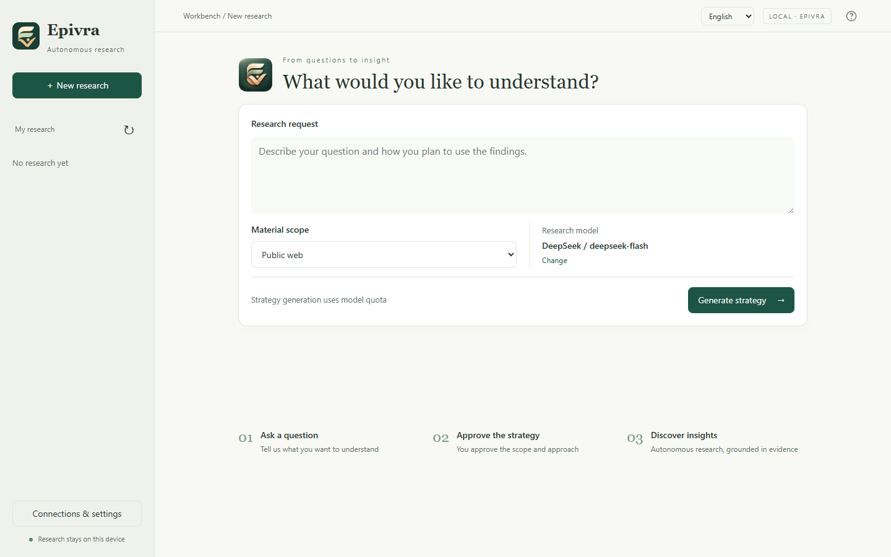

<p align="center"></p>
<h1 align="center">Epivra</h1>
<p align="center">AI research workbench</p>
<p align="center"><strong>English</strong> · <a href="README.zh-CN.md">简体中文</a></p>

Epivra is a locally run AI research application. After you approve a research plan, it automatically gathers and analyzes information from public web sources or supplied documents, then writes and reviews a report with source citations.

[User guide](docs/USAGE.en.md) · [Release notes](https://github.com/studyzhige-ui/Epivra/releases/tag/v0.3.5)



## Quick start

**Windows 10/11 x64 · v0.3.5** · [Download ZIP](https://github.com/studyzhige-ui/Epivra/releases/download/v0.3.5/Epivra-0.3.5-windows-x64.zip)

The desktop download requires no separate Python installation. Bring your own model provider API key.

1. Extract the complete ZIP and run **Epivra.exe**.
2. In the browser, open **Connections & settings** and configure a model and any search services you need.
3. Enter a question, select the source scope and approve the research plan. Read or export the report when it is ready.

Closing the browser leaves research running. Use **Quit** in the Epivra control window to stop the application. The current Windows download is unsigned.

## Capabilities

| Capability | What it provides |
|---|---|
| Research | Web search and research from local text, CSV/TSV, text-layer PDFs and XLSX files |
| Source inspection | Source content and excerpts associated with report citations |
| Task control | Progress, pause/resume, supplementary materials and changes in direction |
| Data analysis | Optional Python calculations, statistics and charts |
| Export | Markdown, Word and HTML; PDF through browser printing |
| Connections | Configurable model/search providers and external MCP tools |

The interface supports English and Simplified Chinese. OCR is an optional download from Settings. The Python analysis component is included in the desktop ZIP and must be prepared and enabled in Settings.

## Data and limitations

- Desktop research data and settings are stored locally, by default in `%LOCALAPPDATA%\Epivra`. Quit the application and back up this directory before upgrading.
- Research calls the configured model, search and MCP services. Related questions and source text may be sent to those services; local execution does not mean offline processing.
- Provider calls may incur charges. Epivra has no total research cost cap.
- Reports undergo automated review, but their conclusions depend on the model and available sources. Check important conclusions against the cited material.

## Run from source

Requires Python 3.11+ and Git. On Windows PowerShell:

```powershell
git clone https://github.com/studyzhige-ui/Epivra.git
cd Epivra
python -m venv .venv
.venv/Scripts/python.exe -m pip install -e ".[mcp]"
.venv/Scripts/epivra-desktop.exe
```

Use `--root <absolute-path>` with the desktop command to open an existing workspace. Terminal and MCP configuration are covered in the [user guide](docs/USAGE.en.md). Source installations require a separate analysis component build; see [desktop build instructions](packaging/README.md).

## Development checks

Requires Node.js 22+ in addition to the source environment above.

```powershell
.venv/Scripts/python.exe -m pip install ruff mypy build
.venv/Scripts/python.exe tools/check_source.py --wheel-dir dist
```

This checks the distributed source and builds a wheel. GitHub runs source checks on pull requests and main; desktop builds also verify native analysis and application startup. Regression tests, evaluation materials and internal development documents remain local.
