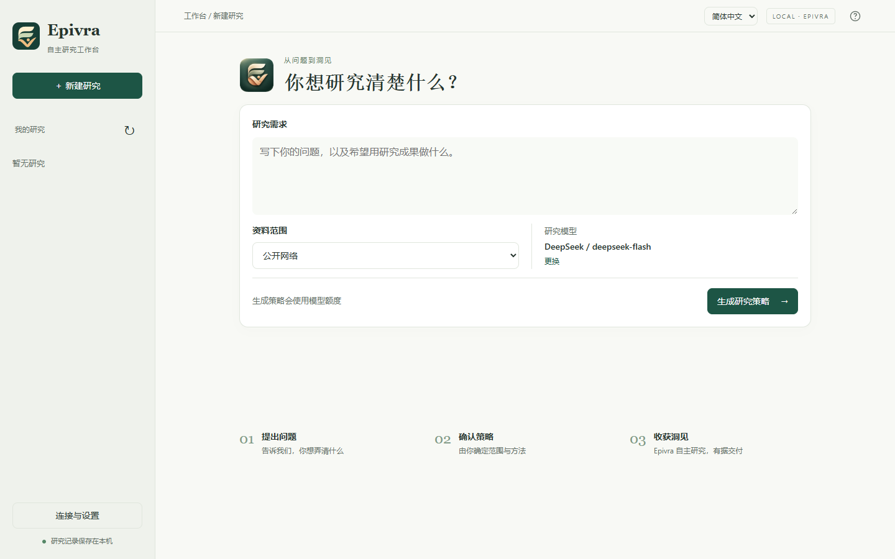

<p align="center"></p>
<h1 align="center">Epivra</h1>
<p align="center">自主研究工作台 · 从问题到洞见</p>
<p align="center"><a href="README.md">English</a> · <strong>简体中文</strong></p>



Epivra 是本地自主研究工作台，将问题与获授权的资料转化为附带来源引用的研究报告。它整合公开网络研究、本地文档、可选的数据分析和外部 MCP 工具。Web、终端与 MCP 接口共享同一个本地研究工作区。

## 下载并打开

**桌面预览版 0.3.0**：无需安装 Python、Git、Node.js 或数据库。

| 你的电脑 | 下载 |
|---|---|
| Windows 10/11，x64 | [下载 Windows ZIP](https://github.com/studyzhige-ui/Epivra/releases/download/v0.3.0/Epivra-0.3.0-windows-x64.zip) |
| macOS 14 或以上，Apple Silicon（M 系列芯片） | [下载 macOS DMG](https://github.com/studyzhige-ui/Epivra/releases/download/v0.3.0/Epivra-0.3.0-macos-arm64.dmg) |

1. **Windows**：完整解压 ZIP，双击其中的 **Epivra.exe**。不要在压缩包内直接运行。
   **macOS**：打开 DMG，将 **Epivra** 拖入“应用程序”，再打开它。
2. 浏览器会自动打开。首次进入“连接与设置”，选择供应商，填入自己的 API Key，选择模型并保存。
3. 输入研究问题、选择资料范围、生成路线，确认后开始研究。

以后只需再次打开 Epivra。重复打开会复用已有工作台。关闭浏览器后研究继续；需要停止后台程序时，在 Epivra 控制窗口点击“退出”。

当前包**未取得 Windows 发布者签名或 Apple 公证**，系统可能提示未知开发者。这是桌面预览版，不承诺无系统提示安装。仓库仍为私有时，下载需要已获授权的 GitHub 账户。[发布说明与 SHA-256](https://github.com/studyzhige-ui/Epivra/releases/tag/v0.3.0) · [详细使用说明](docs/USAGE.md)

基础版支持文本、文本 PDF、表格和联网研究。**OCR 和 Docker 分析在设置中按需准备**，无需重新下载另一种 Epivra 版本。Docker Desktop 需单独安装并启动。

## 研究方式

描述问题、用途与资料范围，阅读并批准初始研究路线。研究负责人调查问题，维护发现和待解冲突，整理写作依据，并持续修订共享稿件。负责人可以直接调查和写作，也可以按需将具体任务交给助手。

研究只需初次批准，之后在已授权范围内自主推进，不再要求重复审批。你可以通过工作台暂停、取消、补充资料或调整方向。保存草稿不等于发布结果：当前稿件必须经过独立审稿者认可才能发布，修改后的稿件需要重新审阅。报告没有默认字数上限。

来源、摘录、研究发现、报告和已记录用量保存在本地工作区。引用检查和独立审阅便于核查，但不保证研究结论正确。

## 入口与能力

| 入口 | 用途 |
|---|---|
| `epivra --lang zh-CN web` | 浏览器工作台：配置连接、管理研究、核查来源、导出报告 |
| `epivra --lang zh-CN` | 交互式终端工作台 |
| `epivra --help` | 用于本地自动化的 JSON 命令 |
| `epivra-mcp --root <工作区绝对路径>` | 向其他客户端提供 MCP 接口；需要 MCP 扩展和已运行的宿主 |

Web 界面可切换简体中文与英文。报告语言请在研究需求中指定。报告可导出为 Markdown、Word 或独立 HTML；PDF 通过浏览器打印对话框导出。

- **模型连接：**通过官方供应商适配器连接 OpenAI、Claude、Gemini、Grok、DeepSeek、Qwen、Kimi、GLM、Doubao、MiniMax、Hunyuan 和 ERNIE。默认选择 DeepSeek / `deepseek-flash`，实际可用性取决于账户。
- **搜索与阅读：**支持 Tavily、Exa、Brave、Perplexity、Bocha、无需密钥的 DuckDuckGo 回退和 Jina 阅读。允许联网的研究还可使用 Crossref、PubMed、Europe PMC 和 World Bank 公共数据。
- **资料：**支持文本、CSV/TSV、文本 PDF 和电子表格；可选的文档扩展提供 Docling 解析与 OCR。资料访问遵守所选授权范围。
- **分析：**可选的 Python 计算与图表在禁止联网的 Docker Linux 容器中执行。
- **外部 MCP：**研究助手可使用明确授权的工具和资源。仅本地资料模式关闭内建网络研究，但仍可使用所选外部 MCP 服务。

供应商调用可能收费。Epivra 不设置研究总时长、token 或费用预算；记录的用量不是账单。

## 可选组件

打开“连接与设置”中的“可选功能”：

- **OCR 文档解析**：点击安装，等待依赖与模型下载、验证完成。适用于扫描件、图片和复杂文档。下载可能需要数 GB；安装期间保持 Epivra 运行。完成后新研究自动使用组件，无需手填模型路径。
- **Docker 数据分析**：先安装并启动 [Docker Desktop](https://www.docker.com/products/docker-desktop/)，再点击“准备 Docker 分析”。镜像准备完成后勾选“启用 Docker 数据分析”。准备镜像需要联网，实际分析容器禁止联网。

两项可以任意组合；不使用时无需下载。准备进度和失败原因显示在设置中。

## 从源码运行（开发者）

需要 Python 3.11+ 和 Git。Windows PowerShell：

```powershell
git clone https://github.com/studyzhige-ui/Epivra.git
cd Epivra
python -m venv .venv
.venv/Scripts/python.exe -m pip install ".[mcp]"
.venv/Scripts/epivra-desktop.exe
```

macOS 对应使用 `.venv/bin/python` 和 `.venv/bin/epivra-desktop`。
已有源码工作区可用 `epivra-desktop --root <绝对路径>` 打开，不会自动搬迁资料或密钥。
[发行构建说明](packaging/README.md)。

## 工作区与仓库结构

| 路径 | 内容 |
|---|---|
| `src/epivra/` | 应用代码、Web 资源和界面翻译 |
| `tools/` | 开发检查与本地诊断工具 |
| `sandbox/` | 隔离分析镜像与执行器 |
| `models/` | 解析模型说明及清单；模型权重保留在本地 |
| `docs/` | 中英文使用说明及 README 图片 |
| `.epivra/` | 本地私有研究、导入资料、设置及恢复记录；不纳入 Git |
| `.env` | 本地供应商凭据；不纳入 Git |
| `mcp-servers.json` | 本地 MCP 连接与权限；不纳入 Git |

桌面版的数据位于 Windows 的 `%LOCALAPPDATA%\Epivra` 或 macOS 的 `~/Library/Application Support/Epivra`，可从控制窗口打开。表中的 `.epivra/`、`.env` 等用户文件在该数据目录内。程序与数据独立，升级前退出 Epivra 并备份整个数据目录，再替换程序文件。源码 CLI/Web 默认仍使用当前工作目录，可明确指定 `--root`。恢复时复用已保存响应；结果未知的调用不会自动重发。运行合同不兼容的研究仍可查阅和导出，但不能隐式恢复执行。

配置、资料、MCP、备份与故障排查见[使用说明](docs/USAGE.md)。

## 开发检查

```powershell
python -m pip install -e ".[mcp]" ruff mypy build
python tools/check_architecture.py
ruff check src tools
mypy
python -m build --wheel
```

这些检查不调用模型或搜索 API。回归测试与评测资料保留在维护者本地，不随本仓库分发。桌面构建仍保留原生应用启动验证。
