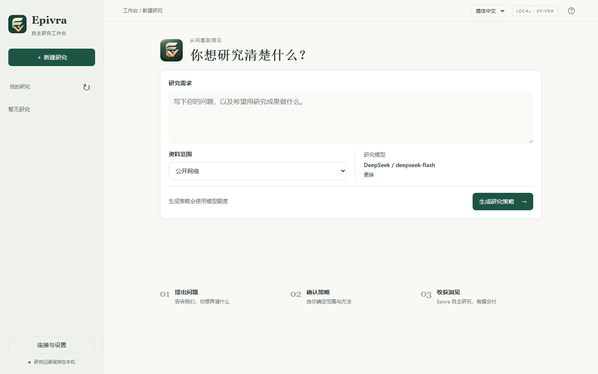

<p align="center"></p>
<h1 align="center">Epivra</h1>
<p align="center">AI 研究工作台</p>
<p align="center"><a href="README.md">English</a> · <strong>简体中文</strong></p>

Epivra 是在本机运行的 AI 研究应用。确认研究路线后，它会自动从公开网页或用户提供的文档中搜集和分析资料，撰写并审阅带来源引用的报告。

[使用说明](docs/USAGE.md) · [发布说明](https://github.com/studyzhige-ui/Epivra/releases/tag/v0.3.6)



## 快速开始

**Windows 10/11 x64 · v0.3.6** · [下载 ZIP](https://github.com/studyzhige-ui/Epivra/releases/download/v0.3.6/Epivra-0.3.6-windows-x64.zip)

桌面版无需另装 Python，需要自备模型供应商的 API Key。

1. 完整解压 ZIP，运行 **Epivra.exe**。
2. 在自动打开的浏览器中进入“连接与设置”，配置模型及所需的搜索服务。
3. 输入问题、选择资料范围，确认研究路线后开始。完成后在工作台阅读或导出报告。

关闭浏览器后研究继续运行；通过 Epivra 控制窗口的“退出”停止程序。当前 Windows 下载包未签名。

## 主要能力

| 能力 | 内容 |
|---|---|
| 资料研究 | 联网检索，或基于本地文本、CSV/TSV、文本型 PDF、XLSX 文件开展研究 |
| 来源核查 | 查看报告引用关联的来源内容与摘录 |
| 任务管理 | 查看进度、暂停与继续、补充资料或调整方向 |
| 数据分析 | 可选的 Python 计算、统计与绘图 |
| 成果导出 | Markdown、Word、HTML；PDF 通过浏览器打印 |
| 连接扩展 | 配置模型与搜索供应商，接入外部 MCP 工具 |

界面支持简体中文和英文。OCR 可在设置中按需下载安装；Python 分析组件随桌面 ZIP 提供，需要在设置中准备并启用。

## 数据与使用边界

- 桌面版的研究数据和设置默认保存在 `%LOCALAPPDATA%\Epivra`。升级前退出程序并备份该目录。
- 研究会调用所配置的模型、搜索和 MCP 服务，相关问题和资料内容可能发送给这些服务。本地运行不代表离线处理。
- 供应商调用可能收费，Epivra 不设置研究总费用上限。
- 报告经过自动审阅，但结论仍受模型和资料质量影响，关键判断需结合引用来源核查。

## 从源码运行

需要 Python 3.11+ 和 Git。Windows PowerShell：

```powershell
git clone https://github.com/studyzhige-ui/Epivra.git
cd Epivra
python -m venv .venv
.venv/Scripts/python.exe -m pip install -e ".[mcp]"
.venv/Scripts/epivra-desktop.exe
```

在桌面启动命令后添加 `--root <绝对路径>` 可打开已有工作区。终端与 MCP 配置见[使用说明](docs/USAGE.md)。源码安装需另行构建分析组件，步骤见[发行构建说明](packaging/README.md)。

## 开发检查

在上述源码环境中，还需安装 Node.js 22+。

```powershell
.venv/Scripts/python.exe -m pip install ruff mypy build
.venv/Scripts/python.exe tools/check_source.py --wheel-dir dist
```

此命令检查公开源码并构建 wheel。GitHub 在 PR 和 main 上执行源码检查，桌面构建还验证原生分析与应用启动。回归测试、评测资料与内部开发文档仅在本地保留。
